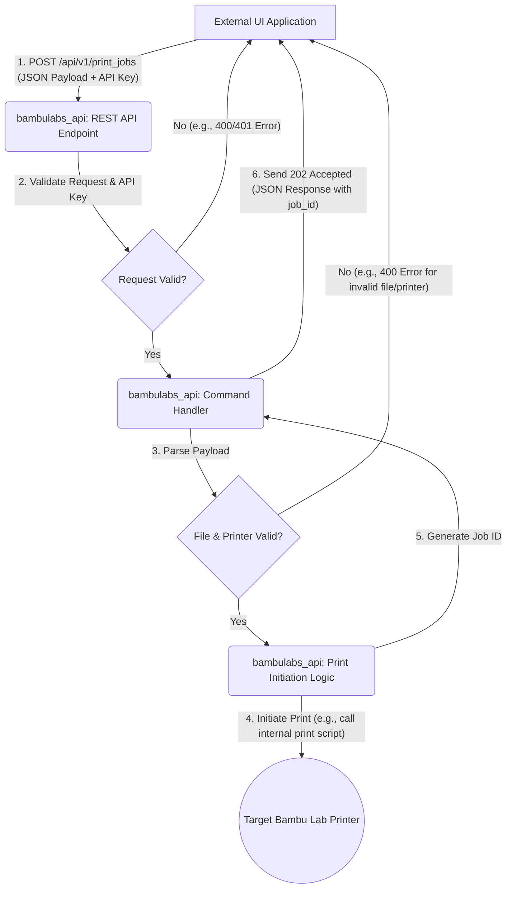

# System Patterns: Remote Print Initiation Interface

## 1. Communication Architecture

A **RESTful API** is chosen as the communication mechanism for the external UI application to send "start print" commands to the `bambulabs_api` application.

**Justification:**

*   **Simplicity & Ubiquity:** REST is a widely understood and adopted standard, making it easy for various client applications to integrate.
*   **Statelessness:** Each "start print" command can be treated as an independent, stateless request, which aligns well with REST principles.
*   **Scalability:** RESTful services can be scaled relatively easily if needed in the future.
*   **Tooling:** Rich tooling and libraries are available for both implementing REST APIs (e.g., Flask, FastAPI in Python) and consuming them.
*   **Sufficient for Current Scope:** For sending commands and receiving acknowledgments, REST provides a suitable level of functionality without the added complexity of WebSockets (for persistent connections) or gRPC (for high-performance RPC), or a message queue (for asynchronous, decoupled systems), which might be overkill for this initial requirement.

## 2. API Endpoint Design

A single endpoint will be exposed by the `bambulabs_api` application to receive print commands.

*   **Endpoint:** `/api/v1/print_jobs`
*   **Method:** `POST`
*   **Description:** Initiates a new print job on a specified printer.

## 3. Command Payload (Request Body)

The `POST` request to `/api/v1/print_jobs` will expect a JSON payload with the following structure:

```json
{
  "printer_id": "string", // Mandatory: Identifier for the target printer (e.g., serial number, or a locally defined alias if bambulabs_api manages multiple)
  "file_path": "string",  // Mandatory: Absolute path to the 3MF or G-code file on the system running bambulabs_api
  "job_name": "string",   // Optional: A user-friendly name for the print job
  "print_parameters": {   // Optional: Object for any specific print parameters. Structure TBD based on bambulabs_api capabilities.
    // Example: "use_ams": true, "ams_filament_ids": ["F0", "F1"] 
  }
}
```

**Field Descriptions:**

*   `printer_id` (string, mandatory): Specifies the target printer. The exact nature of this ID (e.g., serial number, IP address, or an alias managed by `bambulabs_api`) needs to be consistent with how `bambulabs_api` identifies printers.
*   `file_path` (string, mandatory): The absolute path to the printable file (3MF or G-code) accessible by the machine running the `bambulabs_api` application.
    *   *Alternative Consideration (for future):* Instead of a path, the API could accept the file content directly (e.g., base64 encoded), which might be more flexible for UIs not on the same filesystem. However, for simplicity in the initial design, `file_path` is preferred.
*   `job_name` (string, optional): An optional name for the job, useful for logging or display in the UI.
*   `print_parameters` (object, optional): A flexible object to pass any additional print-specific parameters that the `bambulabs_api` might support or require (e.g., specific AMS slot, print profile overrides). The exact structure of this object will depend on the underlying capabilities of the `bambulabs_api`'s print initiation logic.

## 4. Response Structure

*   **Success (202 Accepted):**
    Indicates the command was received and accepted for processing. It does not guarantee the print has started, only that the request is valid and queued.
    ```json
    {
      "status": "success",
      "message": "Print job accepted for printer [printer_id].",
      "job_id": "string" // A unique identifier for the accepted job, generated by bambulabs_api
    }
    ```
*   **Client Error (400 Bad Request):**
    Invalid payload (e.g., missing mandatory fields, invalid file path).
    ```json
    {
      "status": "error",
      "message": "Invalid request payload.",
      "details": "[Specific error details]"
    }
    ```
*   **Authentication Error (401 Unauthorized):**
    Missing or invalid API key.
    ```json
    {
      "status": "error",
      "message": "Authentication required."
    }
    ```
*   **Server Error (500 Internal Server Error):**
    An error occurred within `bambulabs_api` while trying to process the command.
    ```json
    {
      "status": "error",
      "message": "Internal server error while processing print job."
    }
    ```

## 5. Data Flow Diagram



## 6. Security Considerations (Basic)

*   **API Key Authentication:**
    *   The `bambulabs_api` will require an API key to be sent with each request.
    *   The API key should be passed in a standard HTTP header, e.g., `X-API-Key: <your_api_key>`.
    *   The `bambulabs_api` application will have a pre-configured, securely stored API key (or a list of valid keys) that it uses to validate incoming requests.
    *   Requests without a valid API key will be rejected with a `401 Unauthorized` error.
*   **HTTPS:** The API endpoint should be served over HTTPS to ensure command payloads and API keys are encrypted in transit. This requires setting up SSL/TLS certificates for the server running `bambulabs_api`.
*   **Input Validation:** Rigorous validation of all input parameters (especially `file_path`) is crucial to prevent security vulnerabilities like directory traversal attacks. The application should ensure that the `file_path` points to an allowed directory and a valid file type.

**Future Security Enhancements (Out of Scope for Initial Design):**

*   IP Whitelisting
*   Role-Based Access Control (if more operations are added)
*   More sophisticated authentication mechanisms (e.g., OAuth2)